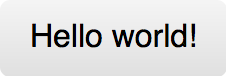
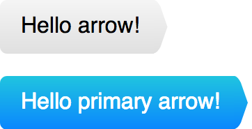

# Tutu.js Meetup
__Экстремальное программирование кнопки__

## Задача
Необходимо реализовать гибкие и расширяемые компоненты кнопки, спиннера, и кнопки со спиннером. Можно использовать любые технологии, но желательно те, которые вы бы использовали в реальном продукте.

Варианты компонентов:
<table border="0" width="800">
	<tr>
		<td border="0" width="500">Кнопка серая</td>
		<td border="0"></td>
	</tr>
	<tr>
		<td border="0">Кнопка синяя</td>
		<td border="0"></td>
	</tr>
	<tr>
		<td border="0">Кнопка со стрелками</td>
		<td border="0"></td>
	</tr>
	<tr>
		<td border="0">Спиннер обычный</td>
		<td border="0"></td>
	</tr>
	<tr>
		<td border="0">Спиннер большой</td>
		<td border="0"></td>
	</tr>
	<tr>
		<td border="0">
		Кнопки со спиннером (по клику на кнопку на несколько секунд показывается спиннер, затем пропадает; кнопка при этом не меняет своего размера).</td>
		<td border="0"></td>
	</tr>
</table>

## Исходники

Страницы живут в `src/app/pages`.

Роуты в `src/app/chain.tsx`.

Компоненты лежат в директории `src/app/components`.

## Набор градиентов

* Серая дефолтная: `linear-gradient(#f5f5f5, #e0e0e0)`
* Серая hovered: `linear-gradient(#f5f5f5, #efefef)`
* Серая active: `linear-gradient(#e0e0e0, #f5f5f5)`
* Синяя дефолтная: `linear-gradient(#20c5e0, #0a86ff)`
* Синяя hovered: `linear-gradient(#2ee2ff, #0a86ff)`
* Синяя active: `linear-gradient(#0a86ff, #20c5e0)`

## Как запустить пример
`npm run dev:build` собирает клиентскую и серверную часть.

`npm start` запускает сервер по адресу [localhost:8080](https://localhost:8080/)

`npm run watch` запускает вотчер клиентского и серверного кода и перезапускает сервер после сборки (работает только в bash окружении).